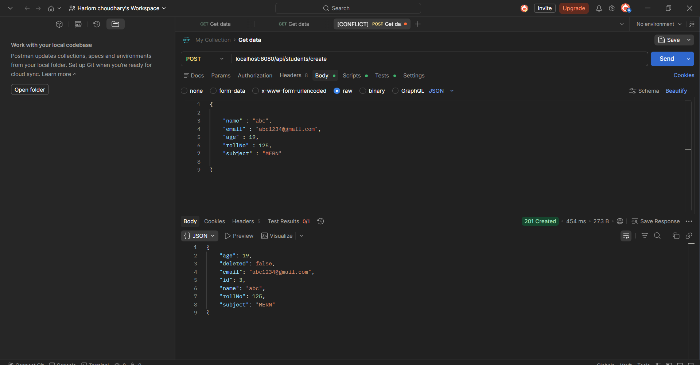
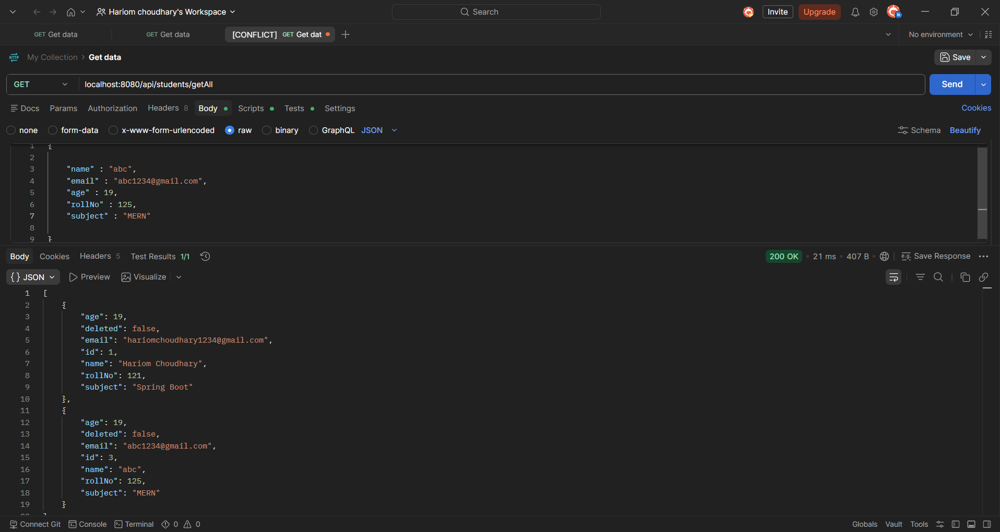
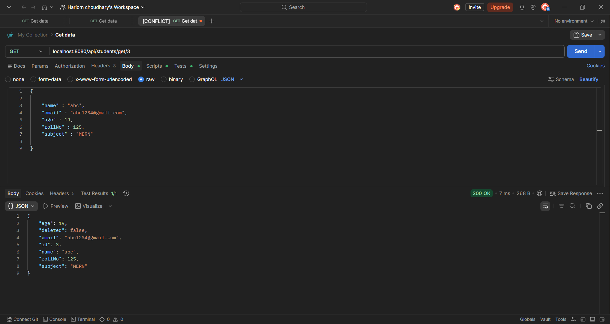
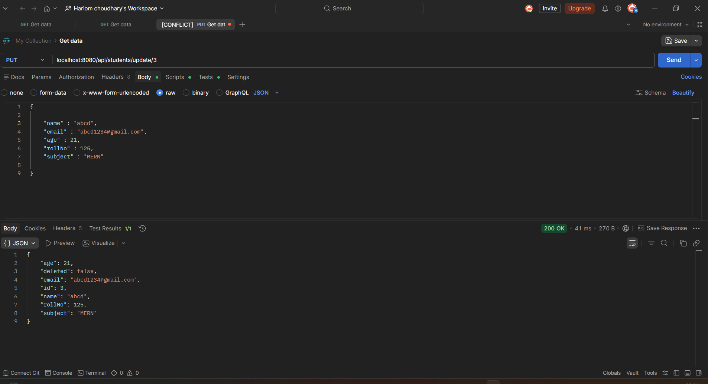
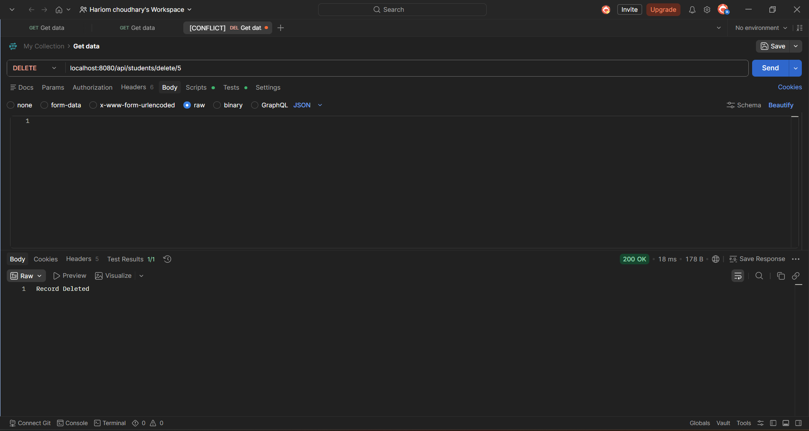
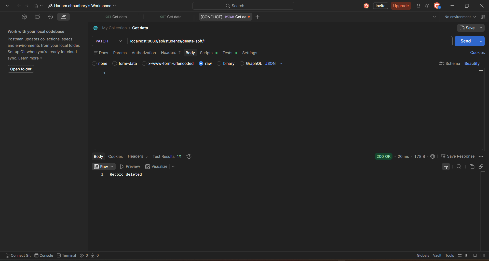

# 🎓 Student Management REST API

A RESTful CRUD application built using **Spring Boot**, **Spring Data JPA**, and **MySQL**. This project demonstrates the implementation of a layered architecture while performing Create, Read, Update, and Delete (CRUD) operations on student records. It also includes a **Soft Delete** feature to retain records instead of permanently removing them.

---

## 🚀 Features

- ✅ Create Student
- ✅ Retrieve All Students
- ✅ Retrieve Student by ID
- ✅ Update Student Details
- ✅ Delete Student (Hard Delete)
- ✅ Soft Delete Student
- ✅ MySQL Database Integration
- ✅ RESTful API Design
- ✅ Layered Architecture (Controller → Service → Repository → Entity)
- ✅ Environment Variable Support for Database Credentials

---

## 🛠 Tech Stack

| Technology | Description |
|------------|-------------|
| Java 21 | Programming Language |
| Spring Boot | Backend Framework |
| Spring Data JPA | ORM |
| MySQL | Database |
| Maven | Build Tool |
| Postman | API Testing |
| DBeaver | Database Management |
| Git & GitHub | Version Control |

---

## 📂 Project Structure

```text
src
├── controller
│     └── StudentController
├──dto
│     └── CreateStudentRequestDto
│     └── CreateStudentResponseDto
│     └── UpdateStudentRequestDto
│     └── UpdateStudentResponseDto
├── service
│     └── StudentService
├── repository
│     └── StudentRepository(JpaRepository)
├── entity
│     └── Student
├── exception
│      └── GlobalExceptionHandler
│      └── DuplicateResourceException
│      └── ResourceNotFoundException
│
└── resources
      └── application.properties
```

---

## 📊 Student Entity

| Field | Type |
|--------|------|
| id | Long |
| name | String |
| age | Integer |
| email | String |
| rollNo | Integer |
| subject | String |
| deleted | Boolean |

---

## 📡 API Endpoints

| Method | Endpoint                    | Description |
|--------|-----------------------------|-------------|
| POST | `/student`                  | Create a Student |
| GET | `/student`                  | Get All Students |
| GET | `/student/id}`              | Get Student by ID |
| PUT | `/student/{id}`             | Update Student |
| DELETE | `/student/{id}`             | Hard Delete Student |
| PATCH | `/student/{id}` | Soft Delete Student |

---

## ⚙️ Database Configuration

Configure the following environment variables before running the project:

```properties
DB_USERNAME=your_mysql_username
DB_PASSWORD=your_mysql_password
```

Example database URL:

```properties
spring.datasource.url=jdbc:mysql://localhost:3306/student_db
```

---

## ▶️ Running the Project

Clone the repository

```bash
git clone https://github.com/hariomchoudhary-dev/spring-boot-crud.git
```

Navigate into the project

```bash
cd spring-boot-crud
```

Run the application

```bash
mvn spring-boot:run
```

The application starts at:

```
http://localhost:8080
```

---

# 📸 API Demonstration

## ➕ Create Student



---

## 📋 Get All Students



---

## 🔍 Get Student By ID



---

## ✏️ Update Student



---

## ❌ Hard Delete Student



---

## 🗑️ Soft Delete Student



---

## 🏗️ Architecture

```
          Client
             │
             ▼
      StudentController
Request DTO  │  Response DTO
             ▼
       StudentService
             │
             ▼
    StudentRepository
             │
             ▼
          MySQL Database
```

---

## 📚 Concepts Used

- Spring Boot
- Spring Data JPA
- REST APIs
- Dependency Injection
- Layered Architecture
- CRUD Operations
- Soft Delete
- Environment Variables
- ResponseEntity
- Maven
- Bean Validation
- DTOs
- Global Exception Handling
- Git & GitHub

---

## 🔮 Future Improvements

- Swagger / OpenAPI
- JWT Authentication
- Pagination & Sorting
- Docker Support
- Unit Testing
- Integration Testing

---

## 👨‍💻 Author

**Hariom Choudhary**

- GitHub: https://github.com/hariomchoudhary-dev
- LinkedIn: https://www.linkedin.com/in/hariom-choudhary-3a0622346/

---

